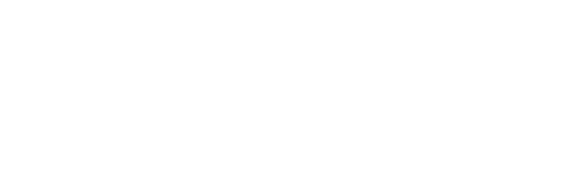

<p align="center">
    
</p>

An internal portal built with [Laravel][laravel] and [Filament][filament] for managing [QubedWP][qubedwp] licenses, clients and subscriptions, designed for clarity, structure, and long-term maintainability.

---

> Please note that Qubed Portal is an internal project of Qubed Group

## Installation

Clone this repository and install dependencies:

```bash
git clone https://github.com/bartvantuijn/qubedportal.git
cd qubedportal
composer install
npm install && npm run build
```

## Configuration

Copy the example environment file and update values to match your setup:

```bash
cp .env.example .env
php artisan key:generate
```

Update `.env` with your database and mail configuration before continuing.

Run migrations:

```bash
php artisan migrate
```

Create an initial admin user:

```bash
php artisan make:filament-user
```

---

## API

Qubed Portal exposes an internal API endpoint that [QubedWP][qubedwp] uses to validate active licenses and subscriptions.
This ensures that only valid installations can use QubedWP themes.

---

### License

Qubed Portal is licensed under the _Functional Source License, Version 1.1, MIT Future License_. It's free to use for
internal and non-commercial purposes, but it's not allowed to use a release for commercial purposes (competing use). See our [full license][license] for more details.

### Contributing

This project is under active development. Contributions are welcome.

[laravel]: https://laravel.com
[filament]: https://filamentphp.com
[qubedwp]: https://github.com/bartvantuijn/qubedwp
[license]: LICENSE.md
